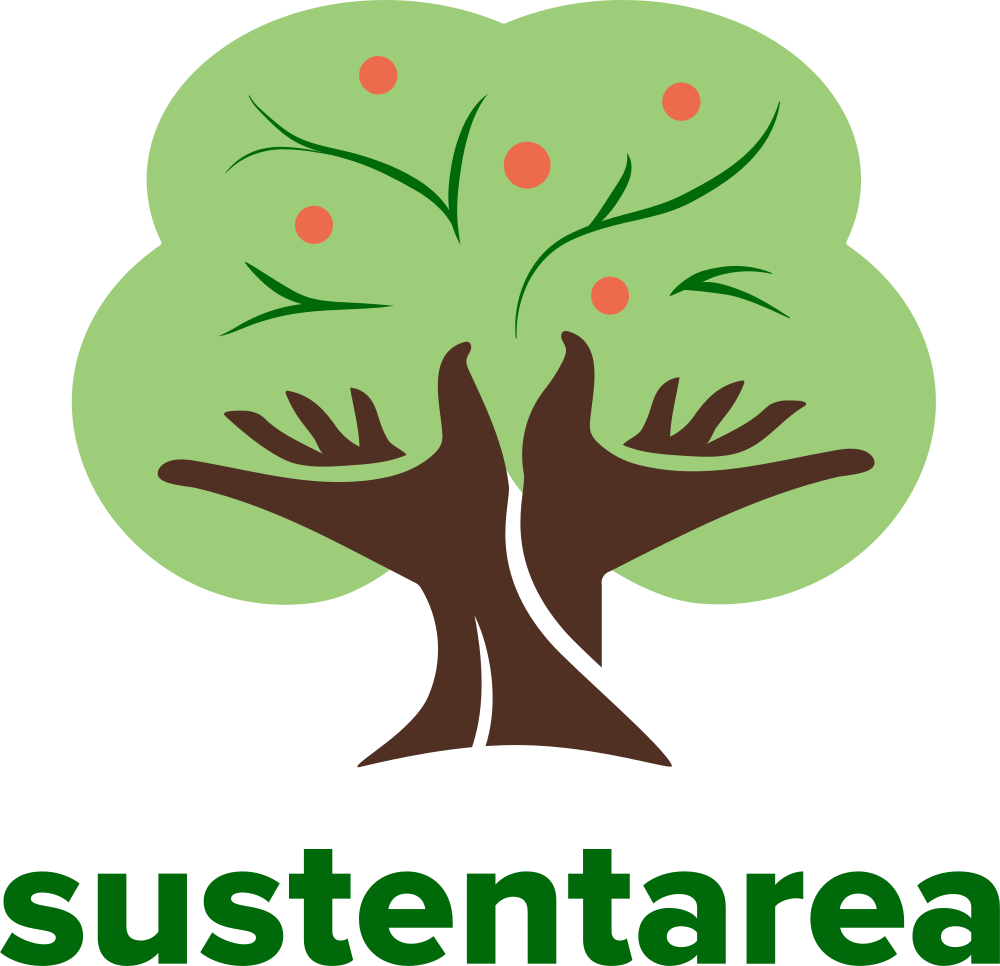

# simbra-pres-2

<!-- badges: start -->
[](https://www.repostatus.org/#inactive)
[](https://www.gnu.org/licenses/gpl-3.0)
[](https://creativecommons.org/licenses/by-nc-sa/4.0/)
<!-- badges: end -->

## Overview

This repository contains the slides from the presentation _logolink: Uma Interface para Execução de Simulações NetLogo a Partir do R_, delivered on May 29, 2026, at the 1st Interdisciplinary Brazilian Symposium on Agent-Based Models ([SIMBRA](https://simbra.com.br)) organized by the [ABM Study Group of the University of São Paulo](https://abmstudygroup.org).

The slides are available [here](https://danielvartan.github.io/simbra-pres-2/).

## Usage

The presentation was made with the [Quarto](https://quarto.org/) publishing system and the [R](https://www.r-project.org/) programming language. To ensure consistent results, the [`renv`](https://rstudio.github.io/renv/) package manages and restores the R environment.

After installing the dependencies mentioned above, follow these steps to start developing it:

1. **Clone** this repository to your local machine.
2. **Open** the project in your preferred [IDE](https://en.wikipedia.org/wiki/Integrated_development_environment).
3. **Install package dependencies** by running [`renv::restore()`](https://rstudio.github.io/renv/reference/restore.html) in the R console. This will install all required software dependencies.
4. **Open** `index.qmd` to start writing.

## Rendering

The rendering process uses the [Quarto](https://quarto.org/) publishing system. Make sure you meet all the requirements listed in the [Usage](#usage) section before moving on.

After installing all dependencies, run the following command in your terminal from the root directory of the project:

```bash
quarto render
```

This will activate the rendering process. Once completed, the HTML report will be available in the [`docs`](docs) folder.

## Citation

To cite this work, please use the following format:

Vartanian, D. (2026). *logolink: Uma interface para execução de simulações NetLogo a partir do R* \[Presentation\].
<https://danielvartan.github.io/simbra-pres-2>

A BibLaTeX entry for LaTeX users is:

``` latex
@online{vartanian2026,
  title = {logolink: Uma interface para execução de simulações NetLogo a partir do R},
  author = {{Daniel Vartanian}},
  year = {2026},
  url = {https://danielvartan.github.io/simbra-pres-2},
  langid = {pt-BR},
  note = {Presentation}
}
```

## License

[](https://www.gnu.org/licenses/gpl-3.0)
[](https://creativecommons.org/licenses/by-nc-sa/4.0/)

The code in this repository is licensed under the [GNU General Public License Version 3](https://www.gnu.org/licenses/gpl-3.0), while the presentation is available under the [Creative Commons Attribution-NonCommercial-ShareAlike 4.0 International](https://creativecommons.org/licenses/by-nc-sa/4.0/).

``` text
Copyright (C) 2026 Daniel Vartanian

The code in this repository is free software: you can redistribute it and/or
modify it under the terms of the GNU General Public License as published by the
Free Software Foundation, either version 3 of the License, or (at your option)
any later version.

This program is distributed in the hope that it will be useful, but WITHOUT ANY
WARRANTY; without even the implied warranty of MERCHANTABILITY or FITNESS FOR A
PARTICULAR PURPOSE. See the GNU General Public License for more details.

You should have received a copy of the GNU General Public License along with
this program. If not, see <https://www.gnu.org/licenses/>.
```

## Acknowledgments

<table>
  <tr>
    <td width="30%">
      <br/>
      <br/>
      <p align="center">
        <a href="https://www.fsp.usp.br/sustentarea/">
          
        </a>
      </p>
      <br/>
    </td>
    <td width="70%">
      <p>
        This work was developed with support from the
        <a href="https://www.fsp.usp.br/sustentarea/">Sustentarea</a>
        Research and Extension Center at the University of São Paulo (<a href="https://www5.usp.br/">USP</a>).
      </p>
    </td>
  </tr>
</table>
