## Oiê! 👋 {.smaller}

```{r}
#| label: setup
#| include: false

library(here)
library(rutils) # github.com/danielvartan/rutils

here("R", ".setup.R") |> source()
```

:::: {.columns}
::: {.column style="width: 47.5%;"}
Esta apresentação tem como objetivo apresentar o [`logolink`](https://danielvartan.github.io/logolink/), uma interface para execução de simulações NetLogo a partir do R.

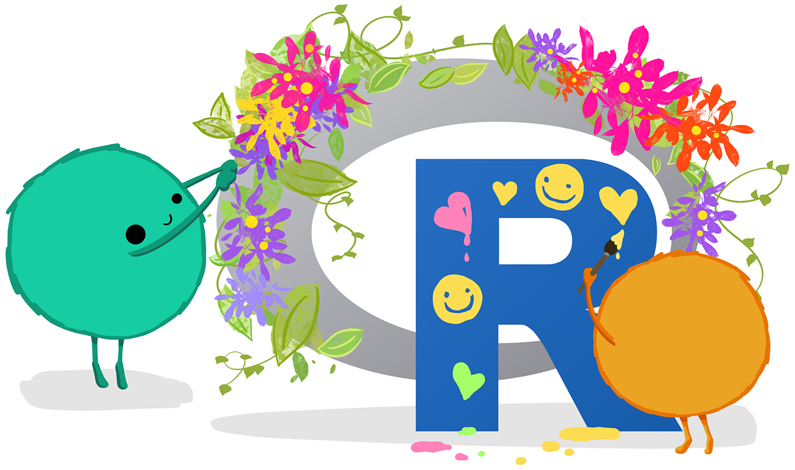{fig-align="center" style="width: 100%; padding-top: 50px;"}
:::
::: {.column style="width: 5%;"}
:::
::: {.column style="width: 47.5%; text-align: center;"}
Tópicos a serem abordados:

1. **R & NetLogo**
1. **Mas Já Não Tem?**
1. **Reprodutibilidade**
1. **O Pacote**
1. **Funções Principais**
1. **Exemplo de Uso**
1. **NetLogo & [`ggplot2`](https://ggplot2.tidyverse.org/)**
:::
::::

::: footer
(Arte de [Allison Horst](https://twitter.com/allison_horst))
:::

::: {.notes}
:::

## {data-menu-title="R & NetLogo"}

::: {layout="[1,1]"}
[{fig-align="center" style="width: 80%; padding-top: 90px;"}](https://www.r-project.org/)

[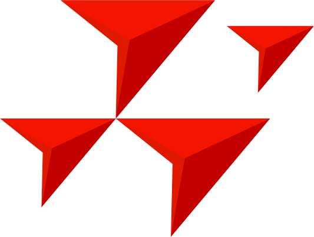{fig-align="center" style="width: 80%; padding-top: 165px;"}](https://netlogo.org/)
:::

::: footer
(Animação de [Allison Horst](https://twitter.com/allison_horst))
:::

::: {.notes}
- R versus Python.
- R: Criado na academia, para a academia. Python: Criado na indústria, para a indústria.
- (piada) Quando uma cobra é usada para representar uma plataforma, já dá pra imaginar que tipo de comunidade ela tem, né?
- [R](https://www.r-project.org/) é uma linguagem de programação **gratuita** e de **código aberto** desenvolvida para análise de dados e geração de gráficos.
- Foi criado a partir da linguagem **S**, por **R**oss Ihaka e **R**obert Gentleman, no departamento de estatística da [Universidade de Auckland](https://www.auckland.ac.nz/) (Nova Zelândia) em 1991 e apresentada à comunidade científica em **1993**.
- Criado por [Uri Wilensky](https://ccl.northwestern.edu/users/uri/) e [Seth Tisue](https://tisue.net/) em 1999, o [NetLogo](https://netlogo.org/) é uma plataforma de modelagem baseada em agentes, projetada para ser fácil de usar e acessível a uma ampla gama de usuários, incluindo aqueles sem experiência prévia em programação.
- Desenvolvido tanto para fins educacionais quanto para pesquisa.
- Parece fraco, mas entrega muito (Base: [Scala](https://pt.wikipedia.org/wiki/Scala_(linguagem_de_programa%C3%A7%C3%A3o)) & [Java](https://pt.wikipedia.org/wiki/Java_(linguagem_de_programa%C3%A7%C3%A3o))).
- _Low Threshold, No Ceiling_.
:::

## {data-menu-title="NetLogo 🐢"}

{fig-align="center" style="width: 80%; padding-top: 50px;"}

::: footer
(Reprodução de @vartanian2025m)
:::

::: {.notes}
:::

## Mas Já Não Tem? {.smaller}

::: {layout="[1,1,1]"}
[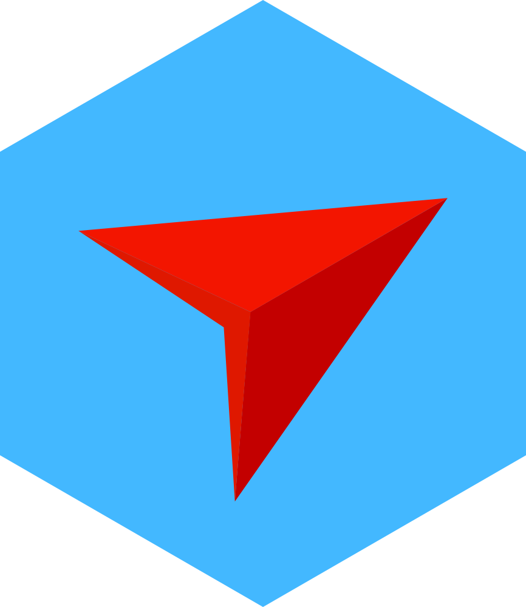{fig-align="center" style="width: 80%; padding-top: 80px;"}](https://danielvartan.github.io/logolink/)

[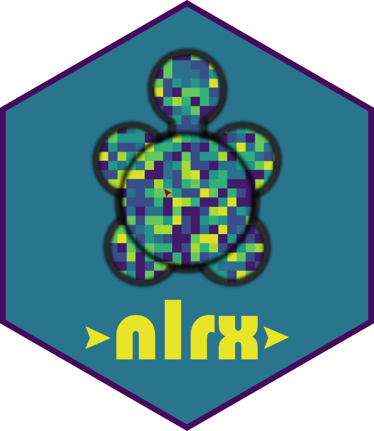{fig-align="center" style="width: 80%; padding-top: 80px;"}](https://docs.ropensci.org/nlrx/)

[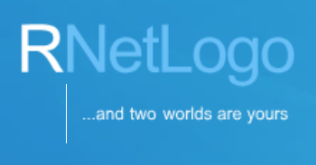{fig-align="center" style="width: 100%; padding-top: 150px;"}](https://cran.r-project.org/package=RNetLogo)
:::

::: {.notes}
- Os autores do `nlrx` (Jan Salecker, Marco Sciaini , Sebastian Hanss) estão começando a implementar o `logolink` para fazer o heavy lifting.
:::

## {data-menu-title="Reprodutibilidade"}

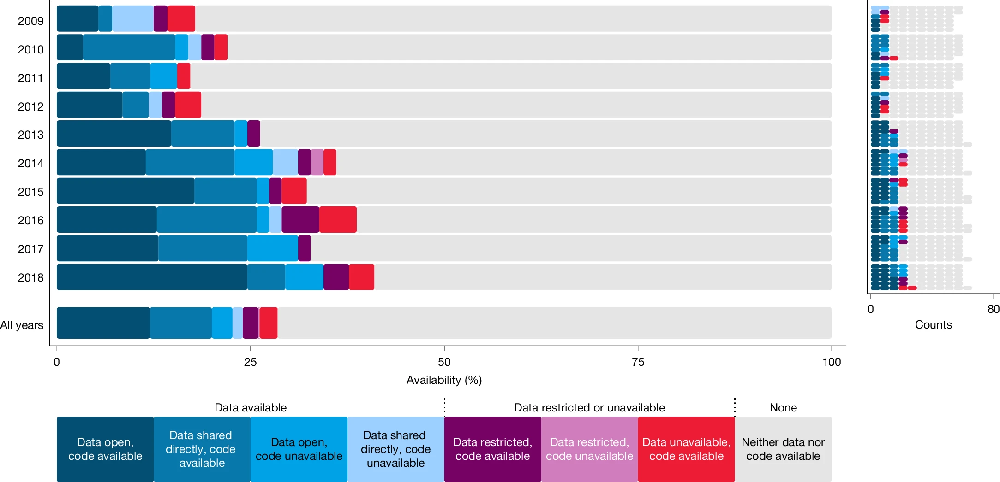{fig-align="center" style="width: 100%; padding-top: 50px;"}

::: footer
[Reprodução de @miske2026]
:::

::: {.notes}
- Pegue uma das [últimas edições especiais](https://www.nature.com/immersive/d42859-026-00015-y/index.html) da Nature sobre o assunto, que curiosamente saiu no dia 1º de abril de 2026.
- Crise de reprodutibilidade.
- **Reprodutibilidade** versus **Replicabilidade**.
- Desenvolvimento de ferramentas abertas e especializadas, capazes de aumentar a transparência e promover a padronização e a reutilização de recursos entre pesquisadores.
- Ações semelhantes: Protocolo ODD, AgentBlocks, [CoMSES Network](https://www.comses.net/) & Open Modeling Foundation ([OMS](https://www.openmodelingfoundation.org/)).
:::

## {data-menu-title="O Pacote" .smaller}

::: {layout="[[1], [1,1,1,1]]"}
[{fig-align="center" style="width: 20%; padding-top: 0px;"}](https://danielvartan.github.io/logolink/)

[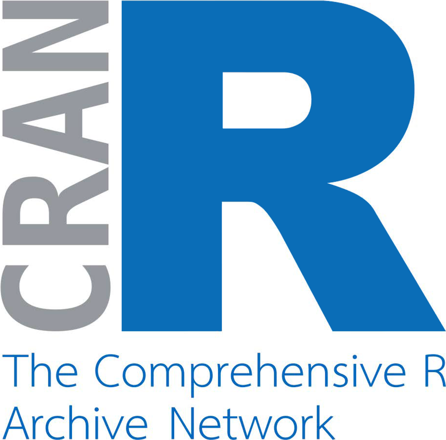{fig-align="center" style="width: 70%; padding-top: 25px;"}](https://cran.r-project.org/)

[{fig-align="center" style="width: 70%; padding-top: 0px;"}](https://ropensci.org/)

[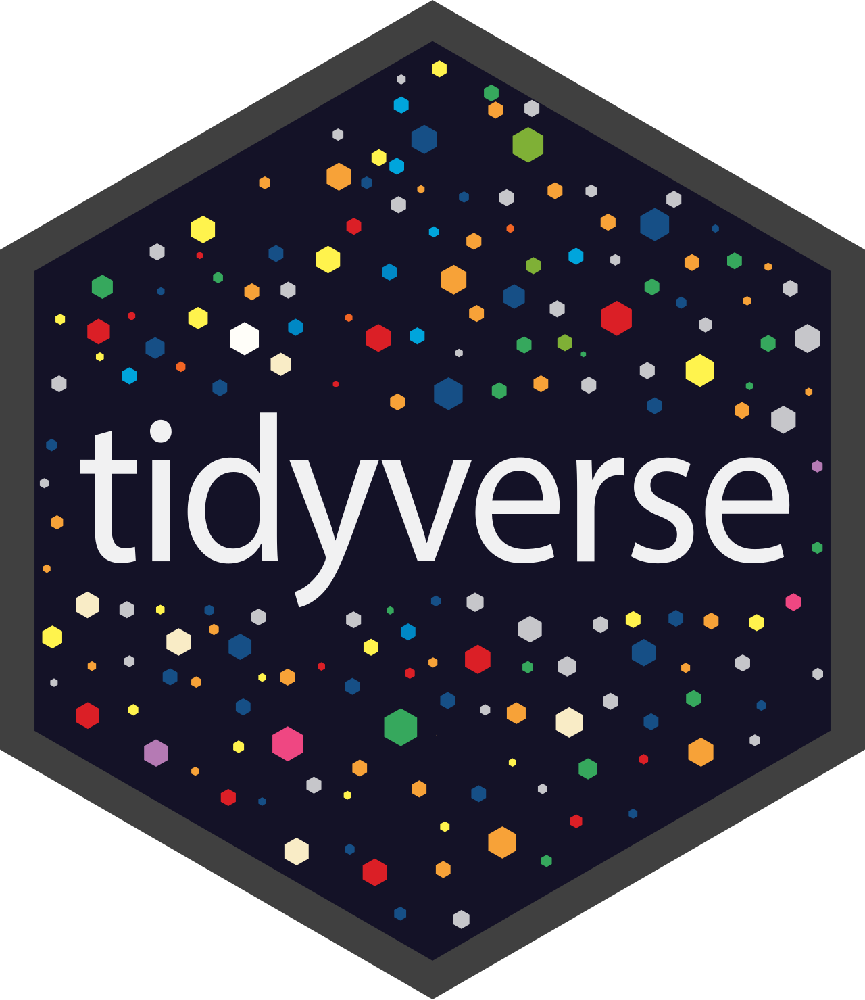{fig-align="center" style="width: 70%; padding-top: 0px;"}](https://tidyverse.org/)

[{fig-align="center" style="width: 100%; padding-top: 75px;"}](https://www.go-fair.org/)
:::

::: {style="text-align: center;"}
Facilmente integrado a [HPCs](https://pt.wikipedia.org/wiki/Computa%C3%A7%C3%A3o_de_alto_desempenho), workflows ([LogoActions](https://github.com/danielvartan/logoactions)), pipelines e notebooks.
:::

::: {.notes}
- Camada de abstração entre R e NetLogo que preserva as nomenclaturas e convenções do BehaviorSpace.
- 100% [FAIR](https://www.go-fair.org/). Publicado na [CRAN](https://cran.r-project.org/) e Revisado por pares pela [rOpenSci](https://ropensci.org/).
- Integrado ao ecossistema [Tidyverse](https://tidyverse.org/) e às melhores práticas de desenvolvimento de software.
- Facilmente integrado a [HPCs](https://pt.wikipedia.org/wiki/Computa%C3%A7%C3%A3o_de_alto_desempenho), workflows, pipelines e notebooks, promovendo reprodutibilidade e transparência.
:::

## {data-menu-title="Instalação e Funções Principais" .smaller}

::: {layout="[1,1]" style="padding-top: 50px;"}
```r
install.packages("logolink")
```

```r
library(logolink)
```
:::

::: {layout="[1,1]"}
```r
create_experiment(
  name = "",
  repetitions = 1,
  sequential_run_order = TRUE,
  run_metrics_every_step = FALSE,
  time_limit = 1,
  pre_experiment = NULL,
  setup = "setup",
  go = "go",
  post_run = NULL,
  post_experiment = NULL,
  exit_condition = NULL,
  run_metrics_condition = NULL,
  metrics = "count turtles",
  constants = NULL,
  sub_experiments = NULL,
  file = tempfile(pattern = "experiment-", fileext = ".xml")
)
```

```r
run_experiment(
  model_path,
  setup_file = NULL,
  experiment = NULL,
  output = "table",
  other_arguments = NULL,
  timeout = Inf,
  tidy_output = TRUE,
  output_dir = tempdir()
)
```
:::

O [`logolink`](https://danielvartan.github.io/logolink/) [&nbsp;detecta automaticamente&nbsp;]{fg="#000000" bg="#ffd000"} sua instalação do NetLogo.

::: {.notes}
:::

## {data-menu-title="Exemplo de Uso" .smaller}

:::: {.columns}
::: {.column style="width: 45%; padding-top: 50px;"}
```r
model_path <-
  find_netlogo_home() |>
  file.path(
    "models",
    "IABM Textbook",
    "chapter 4",
    "Wolf Sheep Simple 5.nlogox"
  )
```

```r
results <-
  model_path |>
  run_experiment(
    setup_file = setup_file
  )
#> ✔ Running model [13.4s]
#> ✔ Gathering metadata [15ms]
#> ✔ Processing table output [8ms]
```
:::
::: {.column style="width: 55%; padding-top: 50px;"}
```r
setup_file <- create_experiment(
  name = "Wolf Sheep Simple Model Analysis",
  repetitions = 10,
  run_metrics_every_step = TRUE,
  setup = "setup",
  go = "go",
  time_limit = 1000,
  metrics = c(
    'count wolves',
    'count sheep'
  ),
  constants = list(
    "number-of-sheep" = 500,
    "number-of-wolves" = list(
      first = 5,
      step = 1,
      last = 15
    ),
    "movement-cost" = 0.5,
    "grass-regrowth-rate" = 0.3,
    "energy-gain-from-grass" = 2,
    "energy-gain-from-sheep" = 5
  )
)
```
:::
::::

::: {.notes}
:::

## {data-menu-title="Exemplo de Uso" .smaller}

::: {style="padding-top: 50px;"}
```r
library(dplyr)
```

```r
results |> glimpse()
#> List of 2
#>  $ metadata:List of 6
#>   ..$ timestamp       : POSIXct[1:1], format: "2026-02-11 12:46:59"
#>   ..$ netlogo_version : chr "7.0.3"
#>   ..$ output_version  : chr "2.0"
#>   ..$ model_file      : chr "Wolf Sheep Simple 5.nlogox"
#>   ..$ experiment_name : chr "Wolf Sheep Simple Model Analysis"
#>   ..$ world_dimensions: Named int [1:4] -17 17 -17 17
#>   .. ..- attr(*, "names")= chr [1:4] "min-pxcor" "max-pxcor" "min-pycor" "max-pycor"
#>  $ table   : tibble [110,110 × 10] (S3: tbl_df/tbl/data.frame)
#>   ..$ run_number            : num [1:110110] 1 1 1 1 1 1 1 1 1 1 ...
#>   ..$ number_of_sheep       : num [1:110110] 500 500 500 500 500 500 500 500 500 500 ...
#>   ..$ number_of_wolves      : num [1:110110] 5 5 5 5 5 5 5 5 5 5 ...
#>   ..$ movement_cost         : num [1:110110] 0.5 0.5 0.5 0.5 0.5 0.5 0.5 0.5 0.5 0.5 ...
#>   ..$ grass_regrowth_rate   : num [1:110110] 0.3 0.3 0.3 0.3 0.3 0.3 0.3 0.3 0.3 0.3 ...
#>   ..$ energy_gain_from_grass: num [1:110110] 2 2 2 2 2 2 2 2 2 2 ...
#>   ..$ energy_gain_from_sheep: num [1:110110] 5 5 5 5 5 5 5 5 5 5 ...
#>   ..$ step                  : num [1:110110] 0 1 2 3 4 5 6 7 8 9 ...
#>   ..$ count_wolves          : num [1:110110] 5 5 5 5 5 5 5 5 5 5 ...
#>   ..$ count_sheep           : num [1:110110] 500 498 497 495 493 492 488 487 486 483 ...
```
:::

::: {.notes}
:::

## {data-menu-title="Exemplo de Uso" .nostretch}

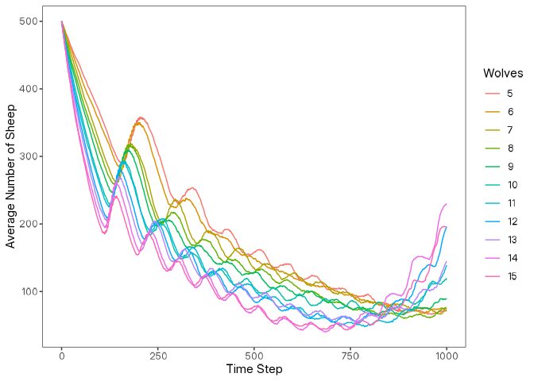{fig-align="center" style="width: 75%; padding-top: 35px;"}

::: {.notes}
:::

## {data-menu-title="NetLogo & ggplot2" .smaller}

::: {layout="[1,1]"}
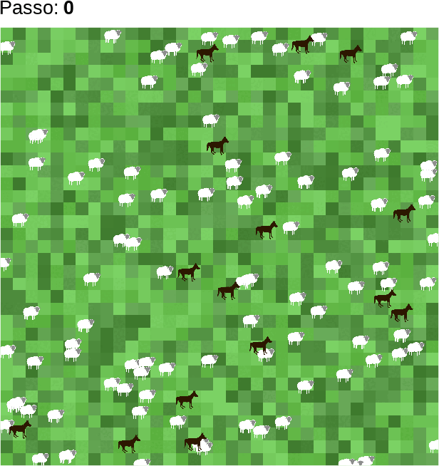{fig-align="center" style="width: 100%; padding-top: 30px;"}

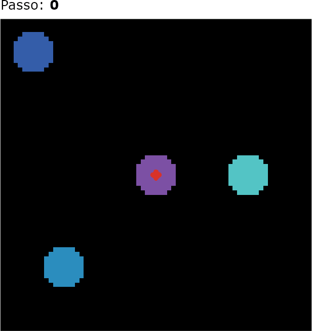{fig-align="center" style="width: 100%; padding-top: 30px;"}
:::

::: {.notes}
:::

## {data-menu-title="Documentation" background-image="images/logolink-vignette-screenshot.png" background-position="top left" background-size="100%"}

::: {.notes}
:::

## Considerações Finais {.smaller}

[{style="width: 12%; padding-top: 0px;"}](https://www.gnu.org/licenses/gpl-3.0)
[{style="width: 19%; padding-top: 0px;"}](https://creativecommons.org/licenses/by-nc-sa/4.0/deed.en)

Esta apresentação foi criada com o sistema de publicação [Quarto](https://quarto.org/). O código e os materiais estão disponíveis no [GitHub](https://github.com/danielvartan/simbra-pres-2).

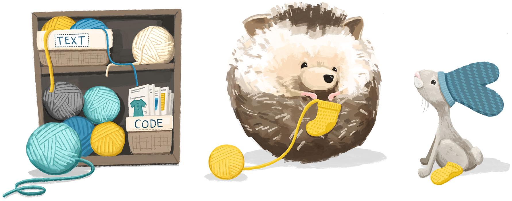{fig-align="center" style="width: 80%; padding-top: 40px;"}

::: footer
(Arte de [Allison Horst](https://twitter.com/allison_horst))
:::

::: {.notes}
:::

## Referências {.smaller}

::: {style="font-size: 0.75em;"}
De acordo com o estilo da American Psychological Association ([APA](https://apastyle.apa.org/)), 7. edição.
:::

::: {#refs style="font-size: 0.75em;"}
:::

::: {.notes}
:::

## Obrigado! {.nostretch}

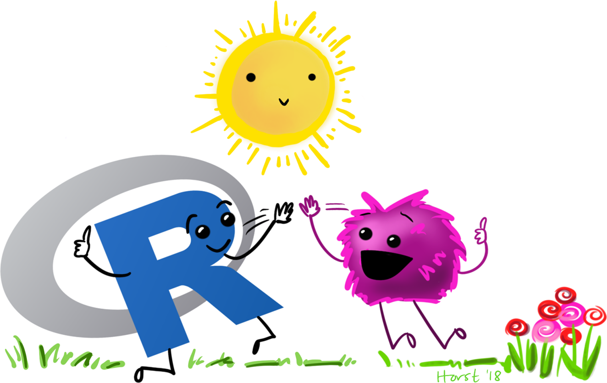{fig-align="center" style="width: 70%; padding-top: 0px;"}

::: footer
(Arte de [Allison Horst](https://twitter.com/allison_horst))
:::

::: {.notes}
:::
